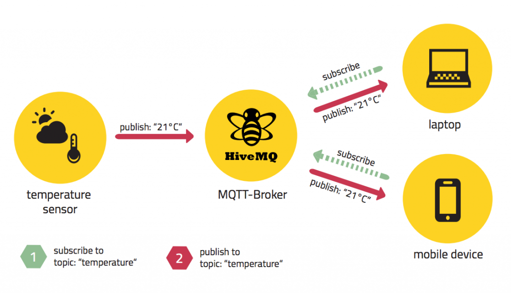

# Spring & Redis - Ranking Board

## Redis on Java
java에서 사용하는 Redis Client는 크게 <code>Lettuce</code>와 <code>Jedis</code>이 있다. 

<code>Jedis</code>는 예전부터 Java의 표준 Redis Client로 많이 사용되어 왔다. 
하지만 <code>Lettuce</code>는 Netty 기반이기에 비동기로 요청을 처리하기 때문에 <code>Jedis</code>보다 고성능이며
멀티 쓰레드 불안정, Pool 한계 등.. 으로 인해 최근에는 <code>Jedis</code>보다 <code>Lettuce</code>를 선호하는 편이다.

이 외에도 잘 만들어진 문서, 깔끔하게 디자인된 코드 등.. 으로 인한 이유도 있다.

*ref : <https://jojoldu.tistory.com/418>

---

## Using Redis on Spring Boot

< Dependency >
```gradle
implementation 'org.springframework.boot:spring-boot-starter-data-redis'
```

< Property >
```yaml
spring:
    redis:
        host: (host name)
        port: (port number)
```

< Configuration Class >
```java
@Configuration
public class RedisConfig {

    @Value("${spring.redis.host}")
    private String host;

    @Value("${spring.redis.port}")
    private int port;

    @Bean
    public RedisConnectionFactory redisConnectionFactory() {
        return new LettuceConnectionFactory(host, port);
    }
}
```

* <code>redisConnectionFactory</code> Function : Redis Connection을 생성; 위에서는 <code>Lettuce</code>를 사용.
  *<code>Jedis</code>를 사용하고 싶다면 [여기](https://jojoldu.tistory.com/418) 의 1-1 부분의 코드를 참고.

---

## Redis Repository
Spring Data Redis의 Redis Repository를 사용하면 손쉽게 Domain Entity를 Redis Hash로 만들 수 있다.

*단 Redis Repository는 Transaction을 지원하지 않는다.

### Entity
```java
@RedisHash(value = "user", timeToLive = 30)     // timeToLive : 초 단위
public class User {
	
    @Id
    private UUID id;
	
    ... 생략
  
}
```

*ref : https://docs.spring.io/spring-data/redis/docs/current/api/org/springframework/data/redis/core/RedisHash.html

### Repository
```java
public interface UserRedisRepository extends CrudRepository<User, UUID> { }
```

---

## CRUD Test
```java
@SpringBootTest
public class RedisRepositoryCrudTest {
    
    @Autowired
    private UserRedisRepository userRedisRepository;
    
    @Nested
    @TestMethodOrder(MethodOrderer.OrderAnnotation.class)
    @TestInstance(value = TestInstance.Lifecycle.PER_CLASS)
    class 단순_기능_테스트 {
        
        private User user;
        
        @BeforeAll
        void init() {
            this.user = new User("junnikym");
        }
        
        @Test
        void ..._테스트 () {
            
            // Create
            userRedisRepository.save(this.user);
        
            // Read
            final User result = userRedisRepository
                    .findById(this.user.getId())
                    .orElseThrow(()-> new RuntimeException("Can not find user"));
        
            ... 생략
            
            // Update
            user.setName("modified name");
            userRedisRepository.save(user);
            
            ... 생략
                    
            // Delete
            userRedisRepository.delete(user);
            
        }
    
    }
}
```

* ref : <https://bcp0109.tistory.com/328>

---

## Redis Template

<code>Redis Template</code>를 사용하면 
<code>Redis Repository</code>와 달리 Entity 외 <code>String</code>, <code>List</code>, <code>Set</code> 등... 
원하는 타입의 값을 넣을 수 있다.

우선, <code>Redis Template</code>를 사용하기 위해 Configuration Class에 다음의 Bean를 선언해주어야한다.
```java
@Configuration
public class RedisConfig {
	
    ... 생략
	
	@Bean
	public RedisTemplate<?, ?> redisTemplate() {

		// RedisTemplate 객체 생성
		RedisTemplate<?, ?> redisTemplate = new RedisTemplate<>();

		// Connection 생성 및 등록
		redisTemplate.setConnectionFactory(redisConnectionFactory());
		
		return redisTemplate;
	}
}
```

### Operations For ...

<code>ValueOperation</code>, <code>ListOperation</code>, <code>SetOperation</code> 등... 
..Operations Interface를 사용하여 데이터를 Serialize 또는 Deserialize 할 수 있다.

Operations Interface는 <code>Redis Template</code>의 opsFor.. Method를 통해 객체를 가져올 수 있다. 

( <code>opsForValue</code>, <code>opsForList</code>, <code>opsForSet</code>, ... )

```java

@Autowired
SpringRedisTemplate redisTemplate;

        ...

final ValueOperations<String, String> valueOperations = redisTemplate.opsForValue();
		
valueOperations.set(key, val);  // val를 key에 저장
valueOperations.get(key);       // key에 해당하는 값을 불러옴   

```

### Redis Template & Spring Redis Template

Redis Template 에는 <code>RedisTemplate</code>과 <code>SpringRedisTemplate</code>이 있다.

둘의 차이는 Serialize를 할 때 사용하는 Serializer가 다르다.
<code>RedisTemplate</code>은 <code>JdkSerializationRedisSerializer</code>를 사용하는 반면,
<code>SpringRedisTemplate</code>는 <code>StringRedisSerializer</code>를 사용한다.

두 Serializer의 차이는 <code>JdkSerializationRedisSerializer</code>는 자바 클래스와 필드정보가 부가적으로 저장되는 반면,
<code>StringRedisSerializer</code>는 그러한 정보를 따로 붙이지 않고 Redis에 저장된다.

만약, <code>JdkSerializationRedisSerializer</code>로 직렬화하여 Redis에 올라갔다면 클래스, 필드 정보가 부가적으로 붙었기 때문에
<code>redis-cli</code>에서 값을 확인하기가 어렵다. 따라서 <code>redis-cli</code>에서 값을 확인하기 위해서는
<code>StringRedisSerializer</code>를 사용하거나 다른 Serializer를 사용해야한다.

반면, <code>StringRedisSerializer</code>를 사용할 경우 <code>ValueOperations</code>를 사용해서 Entity를 Redis에 올릴 수 있지만
<code>StringRedisSerializer</code>를 사용한다면 에러가 발생한다.

위와 같이 <code>ValueOperations</code>를 통해 Entity를 저장해야하는 상황이 발생한다면
<code>JdkSerializationRedisSerializer</code>를 사용하거나 <code>JacksonJsonRedisSerializer</code>와 같은 다른 Serializer를 사용해야 한다.

#### Set Serializer
```java
redisTemplate.setKeySerializer(new StringRedisSerializer());
redisTemplate.setValueSerializer(new StringRedisSerializer());
```
다음과 같이 Redis Template의 <code>set...Serializer</code> Method를 사용하여 Serializer를 따로 지정해 줄 수 있다.

## CRUD Test

### String

```java
@Autowired
private StringRedisTemplate redisTemplate;

private final String key = "RedisTemplateTest_String";

private final ValueOperations<String, String> valueOperations = redisTemplate.opsForValue();
    
    ...
    
        valueOperations.set(key, "1");

        // 다음과 같이 key에 관한 만료시간을 지정해 줄 수 있다.
        redisTemplate.expire(key, Duration.ofSeconds(10));
        
        // get 함수를 통해 key에 해당하는 value를 가져올 수 있다.
        final String item = valueOperations.get(key);
        
        // increment, decrement 함수를 통해 증가, 감소 연산을 할 수 있다.
        valueOperations.increment(key);
        valueOperations.decrement(key, 10);
        
        // 또는 set함수를 통해 key에 저장된 값을 변경 할 수도 있다.
        valueOperations.set(key, "40");
        
        redisTemplate.delete(key);

        // 다음과 같이 할 경우 value 값 조회와 동시에 item을 삭제한다.
        final String itme = valueOperations.getAndDelete(key);
```

### List

```java
@Autowired
private StringRedisTemplate redisTemplate;

private final String key = "RedisTemplateTest_List";

private final ListOperations<String, String> listOperations = redisTemplate.opsForList();

    ...

        // List에 아래 문자 추가 
        listOperations.rightPush(key, "r");
        listOperations.rightPush(key, "e");
        listOperations.rightPush(key, "d");
        listOperations.rightPush(key, "i");
        listOperations.rightPush(key, "s");

		// pushAll 함수로 여러개를 추가할 수 있다.
        listOperations.rightPushAll(key, " ", "t", "e", "m", "p", "l", "a", "t", "e");

        // 다음과 같이 key에 관한 만료시간을 지정해 줄 수 있다.
        redisTemplate.expire(key, Duration.ofSeconds(10));

		// 해당 함수로 리스트의 index에 해당하는 value를 가져올 수 있다.
        final long idxForGet = 4;
        final String nthChar = listOperations.index(key, idxForGet);
        System.out.println(idxForGet + "th character is " + nthChar);

        // size 함수를 통해 list의 사이즈를 가져올 수 있다.
        final Long size = listOperations.size(key);
        System.out.println("size is " + size);

		// range 함수는 범위를 지정하여 범위에 해당하는 list의 value를 가져올 수 있다.
        final List<String> allOfItem = listOperations.range(key, 0, -1);
        System.out.print("all of list value : ");
        for(String it : allOfItem) {
            System.out.print(it);
        }
        System.out.println();

        ...
		
        final Consumer<String> printAll = (comment)-> {
            final List<String> allOfItem = listOperations.range(key, 0, -1);
            System.out.print("all of list value - "+comment+" : ");
            for(String it : allOfItem) {
                System.out.print(it);
            }
            System.out.println();
        };
		
        // left, right 원하는 방향으로 push, pop이 가능
        listOperations.leftPush(key, " ");
        listOperations.leftPushAll(key, "s", "i", "h", "t");
        printAll.accept("after left push");

        listOperations.rightPop(key, 9);
        printAll.accept("after right pop");

		// redisTemplate의 delete 함수를 통해 key에 해당하는 값을 삭제할 수 있다.
        redisTemplate.delete(key);

}
```

위와 같이 redis의 키워드와 유사한 네이밍의 함수를 사용하여 redis에 값을 저장 또는 삭제, 조회, 수정 등.. 이 가능하며
Value, List 타입의 데이터 외에도 Set, ZSet, Hash 등.. 의 타입도 Operations를 통해 Redis의 데이터를 조작할 수 있다.
자세한 사항은 [Spring Docs](https://docs.spring.io/spring-data/redis/docs/current/api/org/springframework/data/redis/core/HashOperations.html) 를 참고 
(해당 링크는 Hash 타입에 관한 Docs)

* ref : <https://sabarada.tistory.com/105>

---

## Redis Pub/Sub

Redis의 <code>Subscribe</code>, <code>Unsubscribe</code>, <code>Publish</code>는 메시지 페러다임을 구현한 기능이다.
<code>Sender</code><sub>Publisher</sub>는 <code>Receiver</code><sub>Subscriber</sub>에게 값을 전달하는게 아닌 
해당 채널에 메시지를 전달하면 그 메시지를 구독하고 있는 <code>Receiver</code><sub>Subscriber</sub>에게 메시지를 전송한다.

### Channel, Brocker and Topic

<code>Publisher</code>가 <code>Message</code>를 보내면 해당 <code>Message</code>는 <code>Broker</code>에게 전달된다.
여기서 <code>Broker</code>는 <code>Channel</code>이라고도 불린다.<br/> 
이때, <code>Message</code>는 <code>Topic</code>이라는 것을 사용하여 누구의 메시지인지 구분한다. 

<code>Subscriber</code>는 <code>Broker</code>를 통해 <code>Topic</code>으로 구분된 <code>Message</code>를 가져감으로써
최종적으로 <code>Message</code>를 받아갈 수 있다.



### Pros & Cons

이러한 Pub/Sub messaging pattern은 <code>느리다</code>라는 단점이 있지만 반면 <code>안전하다</code>라는 장점이 있다.

여기서 <code>Broker</code><sub><code>Channel</code></sub>(이)가 없다면 그만큼 중간 단계가 하나 없어지기 때문에 당연히 빨라질 수 밖에 없다.

하지만, <code>Subscriber</code>에 장애가 생겨 <code>Message</code>를 받을 수 없는 상황에 놓인다면 
<code>Publisher</code>는 계속 하염없이 <code>Subscriber</code>를 가다릴수는 없다. <br/>
그렇기 때문에 <code>Broker</code><sub><code>Channel</code></sub>, <code>Topic</code>를 사용하여 이러한 상황을 방지하고 안정적으로 메시지를 보내는 방법이 등장하였다.

* ref : <https://sugerent.tistory.com/585>

### On Spring

< Configuration Class >
```java
    ...

    @Bean
    MessageListenerAdapter messageListener() {
        return new MessageListenerAdapter(new RedisMessageSubscriber());
    }

    @Bean
    RedisMessageListenerContainer redisContainer() {
        final RedisMessageListenerContainer container = new RedisMessageListenerContainer();
		container.setConnectionFactory(redisTemplate.getConnectionFactory());
		container.addMessageListener(messageListener(), topic());
		return container;
    }

    @Bean
    ChannelTopic topic() {
        return new ChannelTopic("event");
    }
    
    ...
```

<code>RedisMessageListenerContainer</code>를 적용시키므로써 <code>Topic</code>에 관한 <code>Message</code>를 가져올 수 있다.

<code>Listener</code>가 <code>Publisher</code>의 <code>Message</code>를 받기위해서 <code>Publisher</code>를 <code>Subscribe</code>해야한다.
그렇기 때문에 <code>RedisMessageListenerContainer</code>에 <code>Subscriber</code> 객체를 세팅해주어야한다.

< Subscriber Service >
```java
@Service
public class RedisMessageSubscriber implements MessageListener {

    public static List<String> messageList = new ArrayList<>();

    @Override
    public void onMessage(final Message message, final byte[] pattern) {
        messageList.add(message.toString());
        System.out.println("Message received: " + new String(message.getBody()));

    }
}
```

<code>Subscriber</code>는 <code>MessageListenerAdapter</code>의 생성자로 전달되며 여기서 생성된 Adapter를 Container에 설정해줌으로써 최종적으로 
Spring은 Redis의 <code>Publisher</code>를 <code>Listen</code> 할 준비가 된 것이다.

여기서 <code>MessageListener</code>를 상속받은 <code>Subscriber</code>는 <code>onMessage</code> 메소드의 내용을 정의해줌으로써 
<code>Listener</code>가 <code>Message</code>를 받으면 어떤 일을 실행할지 구현할 수 있다.

### MessageListenerAdapter

Configuration 코드를 보면 <code>Subscriber</code>를 <code>MessageListenerAdapter</code>로 씌어 <code>RedisMessageListenerContainer</code>에 적용시킨다.

사실 아래와 같이 <code>Subscriber</code>를 바로 <code>Container</code>에 적용시켜도 아무런 이상이 없다.

```java
    @Bean
	RedisMessageListenerContainer redisContainer() {
		final RedisMessageListenerContainer container = new RedisMessageListenerContainer();
		container.setConnectionFactory(redisConnectionFactory());
		container.addMessageListener(new RedisMessageSubscriber(), topic());
		return container;
	}
```

그럼 <code>MessageListenerAdapter</code> 객체는 무엇을 하며 왜 사용할까? 

#### Java Message Service (JMS) & Message Driven POJO (MDP)

<code>JMS</code>는 RebbitMQ, ActiveMQ 와 같은 메시지 서버와 메세지를 주고받는 기능을 표준화 한 것이다.
즉, JMS란 비동기식 메시징을 위한 표준 API이다. [ref](https://velog.io/@zamonia500/Spring-Messaging-with-JMSJava-Messaging-Service)

<code>Message Driven</code> 란? <code>Event Driven</code>이라 부르기도 하며 어떤 Event가 발생하면 해당 Event에 반응하여 동작을 하는 방식을 말한다. [ref](https://ko.wikipedia.org/wiki/이벤트_(컴퓨팅))

메시지를 비동기적으로 받는다는것은 특정 Queue나 Topic에 대해 응답 논블록킹 프로세스를 가지고 있다는 것이다. 
이 기술은 이벤트 드리븐 형태의 처리 방식이다. 메세지 리스너에서 메시지가 존재하는것을 알려준다. 

<code>Message Driven Beans</code>는 비동기 리스너를 위한 Java EE 기술이다. 
Spring Framework 는 MDP를 사용한 비동기 리스너 역시 지원 한다. 이를 적용하는 방식에는 여러가지 방법이 있지만 
그 중 하나가 <code>MessageListenerAdapter</code>를 사용하는 것이다.

<code>MessageListenerAdapter</code>는 <code>POJO</code> 클래스를 Wrapping 하여 객체를 비동기 메시지 리스너로 만들어준다.  
 * POJO <sub>Plain Old Java Object</sub> : 주요 Java 오브젝트 모델, 컨벤션 또는 프레임워크를 따르지 않는 Java 오브젝트; [ref](https://velog.io/@dion/what-is-POJO)


 * ref : <https://m.blog.naver.com/ssi5719/220551550668>
 
결론적으로 <code>MessageListenerAdapter</code>로 사용하는 이유는 <code>Listener</code>가 비동기적으로 메시지를 받을 수 있게 만들기 위함이다.

### Do publish a message 

< Publisher Message >
```java
@Service
public class RedisMessagePublisher<T> {

	private RedisTemplate<String, T> redisTemplate;

	private ChannelTopic topic;

	public RedisMessagePublisher(RedisTemplate<String, T> redisTemplate, final ChannelTopic topic) {
		this.redisTemplate = redisTemplate;
		this.topic = topic;
	}

	public void publish(T message) {
		redisTemplate.convertAndSend(topic.getTopic(), message);
	}

}
```

해당 Publisher Service 를 사용하여 Message를 발행해보면 해당 위에서 정의한 Subscriber Service에 의해서 
Message 내용이 콘솔에 출력된다.

```java
    ...

    @Test
	void pubSubTest() {
		redisMessagePublisher.publish("published message");
	}
	
    ...

out : 'Message received: published message'
```
---

## Redis Transaction

Redis는 RDB와 다르게 Rollback을 지원하지 않는다. 
단, <code>Queue</code>에 명령을 넣고 쌓인 명령을 일괄적으로 처리함으로써 다른 명령과의 충돌을 보장한다.  

<code>MULTI</code>, <code>EXEC</code>, <code>DISCARD</code>, <code>WATCH</code> 명령어를 이용하여 <code>Transaction</code>을 구상할 수 있다.

| 키워드 | 설명  |
|:---:|:---|
| MULTI | Transaction을 시작; 이후 들어오는 커맨드는 Queue에 쌓이게 된다. |
| EXEC | Queue에 쌓여있는 명령어를 일괄적으로 실행 |
| DISCARD | Transaction을 취소 |
| WATCH | Optimistic Lock; UNWATCH 되기전에는 1번의 EXEC 또는 Transaction 아닌 다른 커맨드만 허용 |
| UNWATCH | WATCH 중단 |

> Optimistic Lock <sub>낙관적 잠금</sub> <br/>
> 데이터 갱신 시 충돌이 일어나지 않을거라고 가정하에 Lock을 적용 <br/> 
> 반대로 Pessimistic Lock <sub>비관적 잠금</sub>은 충돌이 일어날것이라 가정하에 Lock을 적용한다. <br/>
> <br/>
> 따라서 Optimistic Lock은 Dirty read가 되어도 상관이 없는 곳에 사용이된다.<br/>
> <br/>
> ref : <https://itdar.tistory.com/390>
 
*ref : <https://caileb.tistory.com/205>


### Redis Transaction on Spring

Spring에서 Redis Transaction을 적용하는 방법은 크게 2가지가 있는데 
하나는 Operation에서 <code>multi</code>와 <code>exec</code>를 사용하는 것이고,
다른 하나는 <code>@Transaction</code>어노테이션을 사용하는 것이다.

이 글에서는 <code>@Transaction</code>을 활용하는 방법을 소개하고자 한다.

[Spring Docs](https://spring.getdocs.org/en-US/spring-data-docs/spring-data-redis/reference/redis/tx.html)
에 따르면 Spring에서 기본적으로 Transaction을 Disabled로 설정하고 있으며 아래와 같은 설정을 통해 Transaction을 활성화 시켜야 <code>@Transaction</code> 어노테이션을 사용할 수 있다.

설정을 하기 위해선 아래의 3가지 설정을 진행해야한다 

1. <code>@Transaction</code> 어노테이션을 사용하기위해 Spring Context 설정
2. 현재 Thread에 Connection을 바인딩하여 트랜잭션을 적용하도록 설정
3. PlatfromTransactionManager를 Bean으로 등록

> 3step에 PlatfromTransactionManager를 Bean으로 등록하는 이유는 Redis Client인 Jedis와 Lettuce가 
> Transaction Manager를 제공하지 않기 때문에 JDBC나 JPA의 Transaction Manager를 사용해야한다.

< Configuration Class >
```java
@Configuration
@EnableTransactionManagement    // + 1 step
public class RedisConfig {
  
    ...

    @Bean
    public RedisTemplate<?, ?> redisTemplate() {
    
        ...
      
        redisTemplate.setEnableTransactionSupport(true);    // + 2 step
      
        ...
      
    }

    // + 3 step
    @Bean
    public PlatformTransactionManager transactionManager() throws SQLException {
        return new DataSourceTransactionManager(dataSource());      // for JDBC
        or
        return new JpaTransactionManager(entityManagerFactory);     // for JPA
    }
          
    ...
  
}
```

다음과 같이 <code>setEnableTransactionSupport</code> 메소드를 통해 Transaction을 활성화 시키면 
Redis Connection을 <code>MULTI</code>를 작동시킨 Thread에 강제로 바인딩한다.

```java
@Transcation
public void serviceFunc() {
    ...
}
```

다음과 같이 <code>@Transaction</code> 어노테이션을 사용하여 적용시킬 수 있다. 

---

### Single-Thread vs Multi-Thread

Redis를 서칭하다보면 Redis는 Single-Thread 라는 블로그도 있으며 Multi-Thread 라는 블로그도 존재한다.

결론부터 말하면 Redis는 ver 4.0 부터 4개의 쓰래드를 사용하여 동작한다. <br/>
하지만 Core 동작들은 모두 Main-Thread 하나에서 진행하기 때문에 Single-Thread 로 보는것이다.

> ver 6.0 부터는 Threaded IO 가 추가되어 사용자 명령이 Multi-Thread 가 지원이 된다. <br/>
> 하지만 이 또한 I/O Socket read/write 를 할때 멀티쓰레드로 동작하며 코어부분은 여전히 Single-Thread 로 동작한다.<br/>
> <https://taes-k.github.io/2020/07/23/redis-essential/>, <https://redislabs.com/blog/diving-into-redis-6/> 

Main-Thread 외 나머지 3개의 Sub-Thread 의 역할은 다음과 같다

| 번호 |  | 설명  |
|:---:|:---:|:---|
| 1 | BIO_CLOSE_FILE | AOF에 re-write 후 파일을 close 할 때 동작 (AOF를 비활성화해도 Thread는 생성된다.) |
| 2 | BIO_AOF_FSYNC | 매 초당 AOF 에 내용을 쓸 때 동작 |
| 3 | BIO_LAZY_FREE | UNLINK, 비동기 FLUSHALL 또는 FLUSHDB 명령을 처리할 때 동작 |

* ref : <http://redisgate.kr/redis/configuration/redis_thread.php>

> AOF 란? <br/>
> AOF<sub>Append Only File</sub> 방식은 매 명령이 실행될때 마다 파일에 기록되는 Redis의 Persistence 방식 중 하나이다. <br/>
> 조회 명령은 기록되지 않으며 이 외에도 RDB<sub>Redis Database</sub> 방식이 존재하는데 이는 특정 시점에 Snapshot을 바이너리 파일로 저장하여 AOF보다 파일 사이즈가 작으면서도 로딩속도가 빠르다. <br/>
> <br/>
> 따라서 매 명령에 기록되는 AOF가 RDB보다 안전하기 때문에 안전성을 추구하면 AOF를, 안정성보다 속도를 추구하면 RDB를 사용하면된다. (default는 AOF를 사용한다.)
